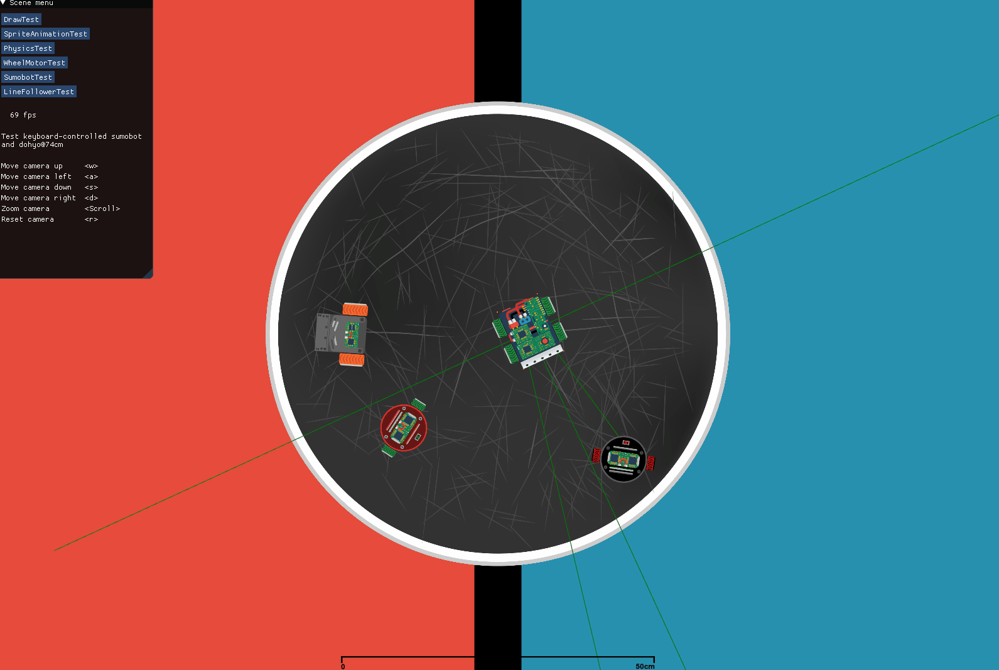
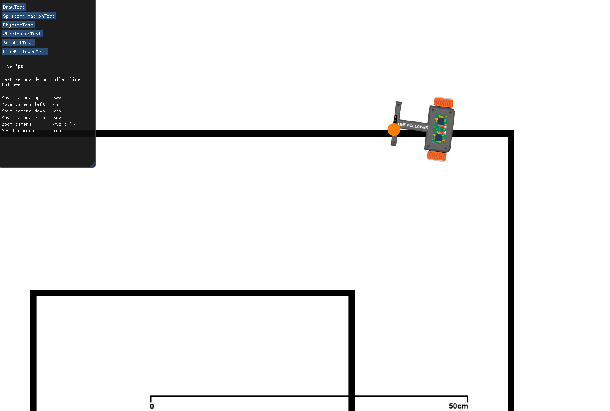

# Description
Bots2D is a C++ library for simulating robotics in 2D. It provides a simulation
framework, including assets, to help you quickly set up your simulation application.





# Background
There are several projects out there for simulating robotics ([Gazebo](http://gazebosim.org/),
[Webots](https://cyberbotics.com/), [V-REP](https://www.coppeliarobotics.com/),
[AirSim](https://github.com/microsoft/AirSim), etc.). These have advanced toolsets and are
great at realistic simulations, but come at the cost of being large projects with overhead,
which is tedious and overkill for simpler simulations.

Despite 2D simulators being useful and much easier to implement, few
well-established projects exist. It's fairly straightforward to develop
one from scratch given the available open-source rendering/physics libraries,
but it still takes quite a bit of work, enough to motivate this library.
Morever, if we are several people who find this project useful, we
can assemble a larger set of reusable robotics assets.

# Features
* C++
* Supports Linux and Windows
* Physics
    - Box2D
    - Top-view and side-view
* Rendering
    - OpenGL, GLFW, ImGui
    - Basic shapes, Texture, Sprite animation
* Robotics assets
    - Complete robots
        + Sumobot with custom dimensions, wheels, sensors, speed, acceleration etc.
        + Line-follower with custom dimenions, wheels, sensors, speed, acceleration, etc.
    - Sensors
        + Range sensor
        + Line detector
    - Actuators
        + Basic DC-motor model with tuneable acceleration and speed characteristics
* Language binding ("Software-in-loop")
    - Controller code can be written in C for easier transfer to a real target.

# Limitations
* Physics
    - Object dimensions limited to 0.01-1m
        + As a consequence of Box2D being limited to 0.1-10m
        + The physics scale factor can be changed, but the width of the span is still limited
    - Approximates top-view physics by setting Box2D gravity to 0 and
      using [b2FrictionJoint](https://box2d.org/documentation/classb2_friction_joint.html) for friction.
* Performance
    - Not optimized for simulating huge amounts of objects
    - Lacks standard optimization techniques such as batch rendering and memory-efficient ECS.
    - Simulation speed is limited to the frame rate, typically 60 Hz
* Not tested on macOS (OpenGL deprecated on macOS)

# Getting started
Bots2D is meant to be used as a library in your own application.
An example application exists under **testapp/**.

## Clone
Bots2D depends on other git projects checked out at specific commits. These
are included as git submodules under **external/**. To clone the repo (including all
submodules), run:

```
git clone --recursive -j8 https://github.com/artfulbytes/bots2d
```

If you have already cloned the repo non-recursively, you can get the submodles with:

```
git submodule update --init
```

## Build
Bots2D is built with CMake. Look at **testapp/** for an example of how to use it
in your application.

### Build testapp on Linux

```
cd testapp/
mkdir build
cd build
cmake ..
cmake --build .
run build/bots2d_testapp
```

### Build testapp on Windows
Tested with Visual Studio 2019:

```
1. Open local folder and select bots2d/testapp
2. After VS has loaded the project, right click on CMakeLists.txt in the solution
   explorer and set as startup item.
3. Start Debugging (F5)
```

## Folder structure
| Folder name | Description                                                  |
| ------------| -------------------------------------------------------------|
| docs        | Documentation                                                |
| external    | External dependencies                                        |
| include     | Bots2D header files                                          |
| resources   | Resources for the renderer (shaders, textures, sprites etc.) |
| src         | Bots2D implementation files                                  |
| testapp     | An example/test application with test scenes                 |
| tools       | Standalone helper tools/scripts                              |

## Documentation
Bots2D is documented with Doxygen. You can generate the documentation with:

```
doxygen docs/Doxyfile
```

Doxygen generates the output to **docs/doxygen/**.

# Known issues
* Rendering is slightly off (probably because of rounding error)
    - i.e physics is fine, but two objects next to each other are rendered with
      a small gap in-between.

# Troubleshooting
* Incorrect OpenGL version (Linux)
    - Check version in console output
    - "export MESA_GL_VERSION_OVERRIDE=3.3"
* "RandR headers not found; install libxrandr development package"
    - GLFW requires xorg-dev liblu1-mesa-dev
    - On Ubuntu, run "sudo apt install xorg-dev libglu1-mesa-dev"

# Contributing
If you make modifications or additions, you are encouraged to submit a pull
request.

# Dependencies
Bots2D depends on the following libraries:

| Name  | Description                     | Lisence     |
| ------| --------------------------------| ------------|
| Box2D | Used for 2D physics          | MIT         |
| glfw  | Used for window management   | zlib/libpng |
| imgui | Used for GUI overlay         | MIT         |
| stb   | Used for image loading       | MIT         |
| glm   | Used for vector math | MIT         |

They are included (unmodified) as git submodules under **external/**.

# Credits
| Name | |
| ---- | ---- |
| [The Cherno](https://www.youtube.com/channel/UCQ-W1KE9EYfdxhL6S4twUNw) | Some of the rendering code stem from his YouTube tutorials. |
| [iforce2d](https://www.iforce2d.net/) | Very useful Box2D tutorials |
